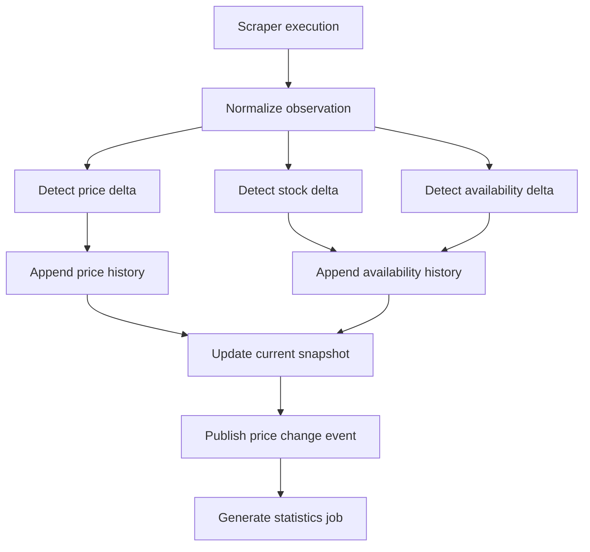
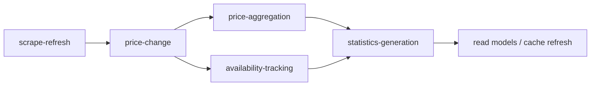

# Price Collection and Price History Engine

## Architecture

The engine is built around append-only price and availability facts. Scraper output is treated as an observation, normalized into a current-state update, and persisted into historical tables without overwriting prior facts. The latest state is derived from the most recent observation, while statistics are materialized asynchronously for fast reads.

### Responsibilities

- Capture every scraper observation.
- Detect price, stock, and availability changes.
- Persist append-only history for full traceability.
- Maintain the current store-product snapshot.
- Recompute aggregates for timeline and comparison views.

### Data model

- `StoreProduct` keeps the current listing snapshot.
- `PriceHistoryEntry` stores each observed change or snapshot.
- `AvailabilityHistoryEntry` stores availability transitions.
- `PriceStatistics` stores the current, previous, lowest, highest, average, and percentage values used by reads.

## Services

- `PriceUpdateService` normalizes an observation, detects deltas, and writes the current snapshot plus history entry.
- `PriceHistoryService` serves timeline reads and current-history lookups.
- `PriceStatisticsService` computes and rebuilds aggregates for products and store products.
- `AvailabilityTrackingService` records stock and availability transitions independently from price movement.

## Repositories

- `StoreProductWriteRepository` persists the current store-product snapshot.
- `PriceHistoryRepository` appends immutable price facts and supports latest-entry reads.
- `PriceStatisticsRepository` stores derived aggregates for fast lookups.
- `AvailabilityHistoryRepository` appends availability transitions.
- `PriceCollectionRepository` records the raw scraper observation before or alongside downstream processing.

## Event Flow

1. A scraper run emits a normalized observation for each store product.
2. The update service compares the observation against the current snapshot.
3. Any delta is written as an immutable history row.
4. The current store-product state is updated only after the history write succeeds.
5. A change event is emitted for downstream jobs and alerting.

## Queue Flow

- `scrape-refresh` receives completed scraper observations.
- `price-change` processes the observation into current and historical writes.
- `price-aggregation` batches related updates so product timelines stay ordered.
- `availability-tracking` records stock transitions independently when the price is unchanged.
- `statistics-generation` rebuilds aggregate values after new history is appended.

## Retention

- History is append-only.
- No observations are deleted.
- Reprocessing is idempotent through source hashes and observation timestamps.
- Aggregates can be rebuilt from the historical ledger at any time.